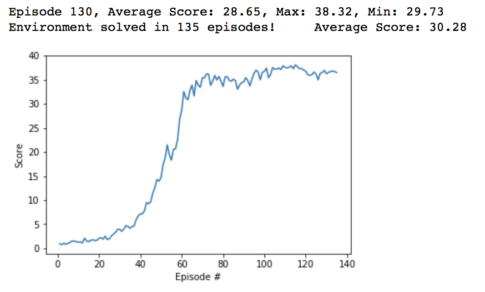

## Methodology

This work implements the DDPG algorithm (Deep Deterministic Policy Gradients) to the 20 agents Reacher environment, as described in [_Continuous Control with Deep Reinforcement Learning_][ddpg-paper] (Lillicrap et al). The foundation of this code-base is from the [Udacity DRL `ddpg-bipedal` notebook][ddpg-repo]

[ddpg-paper]: https://arxiv.org/pdf/1509.02971.pdf
[ddpg-repo]: https://github.com/udacity/deep-reinforcement-learning/blob/master/ddpg-bipedal/DDPG.ipynb

DDPG is an Actor-Critic method that adopts the concepts of Q-Learning to a continuous domain. The Actor learns the policy directly and outputs the actions for the agents to take. The Critic approximates the action-value function Q(s,a) and outputs a single output given a state. The DDPG algorithm generates trajectories through interaction with the environment. Thereby, the actors selects actions. The trajectories are stored in a replay buffer and then randomly sampled to prevent correlations over time. The trajectories are used to train the critic network and approximate the state-value function. In the initial DQN paper it was shown that splitting training into target and local networks helped to stabilize learning significantly by fixing the targets against which to optimize, hence it was adapted here. The same applies to soft-updates instead of directly copying the network weights. In order to help the actor network with exploration and exploitation during traing an Ornstein-Uhlenbeck process is used to generate random noise. The noise gets scaled, added to the output of the actor network and clipped to keep it within the desired output range.

## Implementation 

The network comprises of 2 networks:

**Actor**   
Input: BatchNorm(state-size)  
Hidden 1: Linear(400) -> ReLU -> BatchNorm  
Hidden 2: Linear(300) -> ReLU -> BatchNorm  
Output: Linear(action-size) -> TANH

**Critic**   
Input: BatchNorm(state-size)    
Hidden 1: Linear(400) -> ReLU -> BatchNorm  
Concat: Concat(Critic-Hidden-1, Actor-Output)  
Hidden 2: Linear(300+action-size) -> ReLU -> BatchNorm  
Output: Linear(1)

**Hyperparameters**

- replay buffer size = 1e6
- minibatch size = 64
- discount factor = 0.99
- tau for soft update of target parameters = 1e-3
- learning rate of the actor = 1e-4
- learning rate of the critic = 3e-4
- L2 weight decay = 0
- number of timesteps until update = 20
- number of updates per agent update = 10

## Results 

The agents were able to solve the task after 135 episodes with a final average score of 30.28.

## Enhancements

- It will be possible to further improve the results by tuning the networks scructures (adding layers or units per layers, ...) and hyperparameters
- Implement TRPO, PPO, D3PG or D4PG that probably would produce even better results
- Use a recurrent network architectue (Recurrent DDPG) 

